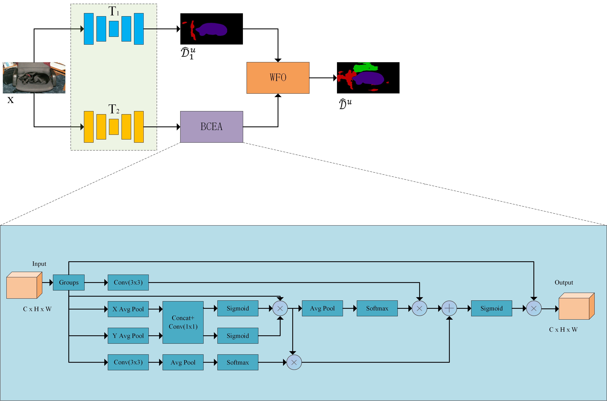

# BST
**摘要：【目的】** 传统自训练半监督语义分割方法的效果受限于初始模型的分割效果以及单一模型迭代训练过程中错误标签导致的模型退化问题。为了解决这两个问题，结合分支注意力机制，构建一种分支网络自训练框架。【 **方法** 】提出了一种基于分支网络协同训练的半监督图像语义分割自训练框架，解决单一分割网络在自生成伪标签错误识别方面的局限性。设计一种分支注意力融合模块，对特征提取网络进行改进，增强了对语义信息的捕获能力，提升分割精度扩充语义信息。提出加权融合操作模块，将具有不同侧重语义信息伪标签在像素级别上施加噪声提升模型泛化性。【 **结果** 】在最常用PASCAL VOC 2012数据集和Cityscapes数据集上利用获得的伪标签进行分割网络的训练，在对比实验中均取得最优结果，此外，通过开展相关的消融实验和对比实验，验证了模型的有效性。【 **结论** 】分支网络自训练半监督语义分割方法通过引入注意力机制提升了分割精度，利用分支结构和加权融合模块扩充了提取的语义信息，有效缓解了模型退化问题，方法的通用性可为其他分割应用领域研究提供参考。



#### Pre-trained Model

[ResNet-50](https://download.pytorch.org/models/resnet50-0676ba61.pth) | [ResNet-101](https://download.pytorch.org/models/resnet101-63fe2227.pth) | [DeepLabv2-ResNet-101](https://drive.google.com/file/d/14be0R1544P5hBmpmtr8q5KeRAvGunc6i/view?usp=sharing)

#### Dataset

[Pascal JPEGImages](http://host.robots.ox.ac.uk/pascal/VOC/voc2012/VOCtrainval_11-May-2012.tar) | [Pascal SegmentationClass](https://drive.google.com/file/d/1ikrDlsai5QSf2GiSUR3f8PZUzyTubcuF/view?usp=sharing) | [Cityscapes leftImg8bit](https://www.cityscapes-dataset.com/file-handling/?packageID=3) | [Cityscapes gtFine](https://drive.google.com/file/d/1E_27g9tuHm6baBqcA7jct_jqcGA89QPm/view?usp=sharing)

#### File Organization

```
├── ./pretrained
    ├── resnet50.pth
    ├── resnet101.pth
    └── deeplabv2_resnet101_coco_pretrained.pth
  
├── [Your Pascal Path]
    ├── JPEGImages
    └── SegmentationClass
  
├── [Your Cityscapes Path]
    ├── leftImg8bit
    └── gtFine
```

### Training and Testing

```
export semi_setting='pascal/1_8/split_0'

CUDA_VISIBLE_DEVICES=0,1 python -W ignore main.py \
  --dataset pascal --data-root [Your Pascal Path] \
  --batch-size 16 --backbone resnet50 --model deeplabv3plus \
  --labeled-id-path dataset/splits/$semi_setting/labeled.txt \
  --unlabeled-id-path dataset/splits/$semi_setting/unlabeled.txt \
  --pseudo-mask-path outdir/pseudo_masks/$semi_setting \
  --save-path outdir/models/$semi_setting

export semi_setting='Cityscapes/1_8/split_0'

CUDA_VISIBLE_DEVICES=2 python -W ignore main.py
 --data-root  Cityscapes
 --labeled-id-path dataset/splits/cityscapes/1_8/split_0/labeled.txt 
 --unlabeled-id-path dataset/splits/cityscapes/1_8/split_0/unlabeled.txt 
 --pseudo-mask-path outdir/pseudo_masks/1_8/split_0 
 --save-path outdir/models/1_8/split_0 
 --plus 
 --reliable-id-path outdir/reliable_ids/1_8/split_0
